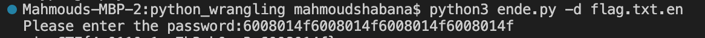
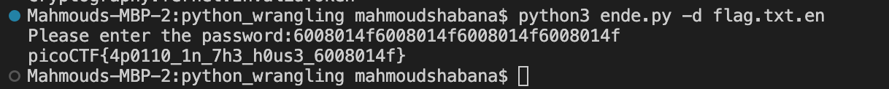

# PicoCTF Write-Up for General Skills challenges:

### Python Wrangling:

The challenge provides us with three files; <code>ende.py</code>, <code>pw.txt</code>, and <code>flag.txt.en</code>. Let's first take a look at the python script:

```
import sys
import base64
from cryptography.fernet import Fernet


usage_msg = "Usage: "+ sys.argv[0] +" (-e/-d) [file]"
help_msg = usage_msg + "\n" +\
        "Examples:\n" +\
        "  To decrypt a file named 'pole.txt', do: " +\
        "'$ python "+ sys.argv[0] +" -d pole.txt'\n"


if len(sys.argv) < 2 or len(sys.argv) > 4:
    print(usage_msg)
    sys.exit(1)
```

These <code>msg</code> variable seem like terminal messages to instruct on what tags and arguments to use when running the script. Maybe if we try using the <code>-d</code> tag on the <em>flag.txt.en</em> file, we can see what the flag is.

input the following into terminal:

<code>python3 ende.py -d flag.txt.en</code>

The terminal asks for a password input, lets use the provided password in <em>pw.txt</em> as the input:



The output is the flag for the challenege:


